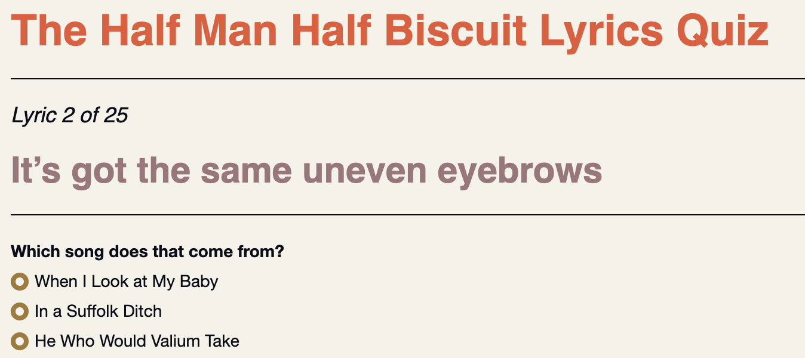

# Music Lyric Quiz

This repo contains all the files needed to make a simple Music Lyric Quiz app in Shiny, using the Genius API. 

The *Lryic_Quiz.R* script connects to the [Genius](https://genius.com/) API and collects songs and lyrics for a given artist.

The RDS file created at the end of this script is passed to a data folder that will be called when *app.R* renders the app. This app file also calls a number of other files:

* The *www* folder contains CSS style sheet.
* The *app_markdown_files* folder contains footer text
* The *helper* folder contains a script, *misc.R*, which has the *prep_quiz* function that will render question in the app, along with a URL. 
* The helper folder also contains *load_packages.R*, which *app.R* uses to load required packages.

See this post on my website for a walk through and discussion of the process.
                    

